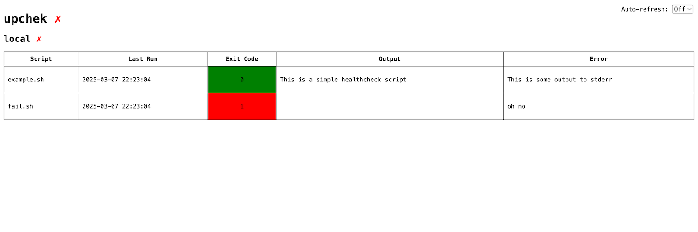
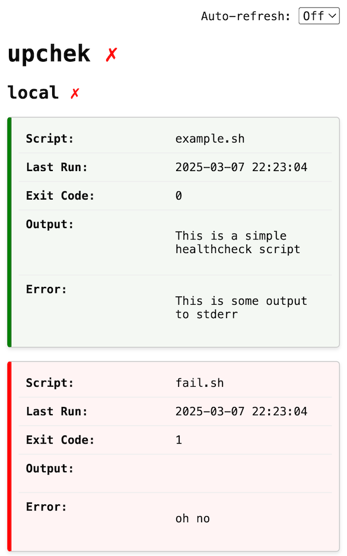

# upchek

upchek is a simple tool to run healthcheck scripts in a user-provided directory
and show the results in a simple, plain HTML web page.

It makes it easy to add ad-hoc healthchecks to your system and have them
automatically run and displayed.

It also exposes a `/healthz` endpoint that can be used to check the overall
system health.

## Screenshots

